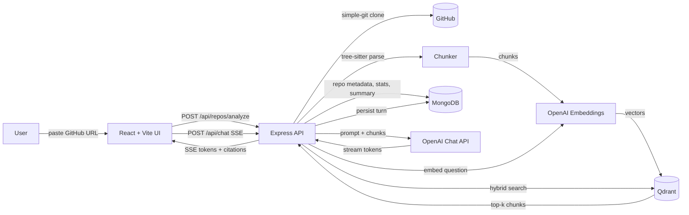

# Codebase Onboarding Assistant

> Paste a public GitHub repo URL. The app clones it, splits the code into
> AST-aware chunks, embeds them, and lets you chat with the codebase. Every
> answer is grounded in retrieved code and cites the exact files and line
> numbers it used.

A small but production-shaped RAG application: React frontend, Express
backend, Qdrant for vector search, MongoDB for metadata + chat history,
tree-sitter for code chunking, and OpenAI for embeddings and generation.

---

## Table of contents

- [Demo](#demo)
- [Features](#features)
- [Architecture](#architecture)
- [How RAG works here](#how-rag-works-here)
- [Tech stack](#tech-stack)
- [Local setup](#local-setup)
- [API reference](#api-reference)
- [Project layout](#project-layout)
- [Cost & limits](#cost--limits)
- [Roadmap](#roadmap)

---

## Demo

> Add a screenshot or GIF here once deployed.
> Live demo: _coming soon_.

The MVP flow:

1. Paste `https://github.com/owner/repo` on the home page.
2. Backend clones the repo, chunks it with tree-sitter, embeds the chunks
   with `text-embedding-3-small`, and pushes them into a Qdrant collection.
3. The repo view loads with an auto-generated architecture overview, stats
   (files / chunks / languages), and a chat box.
4. Ask questions. Answers stream in token-by-token (SSE) and ship with
   clickable citations back to the exact lines on GitHub.

---

## Features

- **Public GitHub repo ingestion** via shallow `git clone` + Octokit
  metadata (size / privacy / default branch pre-flight checks).
- **AST-aware chunking** with `tree-sitter` grammars for JavaScript,
  TypeScript, TSX, and Python — chunks are functions, classes, methods,
  interfaces, type aliases, etc.
- **Embeddings** with `text-embedding-3-small` (1536-dim, ~$0.02 / 1M
  tokens). Batched to keep latency and request size bounded.
- **Hybrid retrieval**: cosine similarity in Qdrant + exact `name` payload
  filter for symbol references the user mentions in backticks or
  CamelCase / snake_case.
- **Streaming chat** over Server-Sent Events. Tokens render as they arrive,
  identical UX to ChatGPT.
- **Grounded citations** rendered next to each answer, deep-linked to the
  exact line range on `github.com/owner/repo/blob/<branch>/<path>#L10-L35`.
- **Caching**: repos already indexed within the last 24h are reused
  instead of re-embedded.
- **Hard safety rails**: max files, max lines, max file size, max tokens
  on every LLM call. Cloned repos are deleted after indexing.

---

## Architecture



**Why this shape?** Two clean phases:

1. **Indexing (write path)** — clone → chunk → embed → upsert → summary.
   Bounded, idempotent, cached.
2. **Querying (read path)** — embed question → hybrid retrieve → prompt
   with top-K → stream answer with citations.

Both phases are independent: re-indexing a repo doesn't disturb live chats
on a different repo, and chat is stateless on the server beyond the
persisted `ChatSession` document.

---

## How RAG works here

RAG ("Retrieval-Augmented Generation") fixes a fundamental problem with
LLMs: they don't know your code, and fine-tuning a model on a repo is
slow, expensive, and stale by morning.

Instead, we keep the model frozen and **retrieve** the right snippets at
query time:

1. **Chunk** the codebase into semantically meaningful units (functions,
   classes, methods). Fixed-line chunking would destroy meaning — half a
   function on one chunk and half on another retrieves badly. tree-sitter
   gives us AST node boundaries cheaply.

2. **Embed** every chunk into a 1536-dim vector with
   `text-embedding-3-small`. Vectors land in Qdrant with the original
   content + file path + line numbers + language as payload.

3. **Retrieve** at query time by embedding the user's question and pulling
   the top-K nearest chunks (cosine). If the question contains an exact
   symbol name (e.g. `` `parseGithubUrl` `` or `MyClass`), we also fetch
   any chunk whose `name` payload matches and merge — basic hybrid search,
   bigger gains than you'd expect.

4. **Generate** by stuffing those K chunks into a system message labeled
   `RETRIEVED CONTEXT`, then asking gpt-4o-mini to answer the question
   citing file paths + line numbers. We force citations in the system
   prompt and cap `max_tokens` to keep costs predictable.

5. **Stream** tokens back over SSE so the UI feels alive.

The model is told explicitly:

> Use ONLY the provided code chunks as context. […] If the answer isn't in
> the provided chunks, say "I don't see that in the indexed code" rather
> than guessing.

That single line prevents most of the hallucinated-method-name problem.

---

## Tech stack

| Layer | Choice | Why |
|---|---|---|
| Frontend | React + Vite + TailwindCSS | Fast dev loop, no SSR overhead, easy deploy. |
| Backend | Node.js + Express | Boring, well-known, fast enough for MVP. |
| Database | MongoDB (Atlas free tier) | Schema-flex for repo metadata + chat sessions. |
| Vector DB | Qdrant (local Docker / Cloud free tier) | Free, fast, payload filters are first-class. |
| Embeddings | `text-embedding-3-small` (1536-dim) | Cheapest viable OpenAI embedder; ~$0.02 / 1M tokens. |
| Chat LLM | `gpt-4o-mini` | Cheap, fast, plenty good for codebase Q&A. |
| Chunking | `tree-sitter` (JS / TS / TSX / Python) | AST-driven semantic boundaries. |
| Git access | `simple-git` + `@octokit/rest` | Clone + pre-flight metadata. |

---

## Local setup

### Prerequisites

- Node 18+
- Docker (for local Qdrant and MongoDB) **or** Qdrant Cloud + MongoDB Atlas accounts
- One of:
  - An OpenAI API key (recommended quality), **or**
  - [Ollama](https://ollama.com) running locally (free, no signup — see
    "Running with Ollama" below)

### 1. Clone and install

```bash
git clone <this-repo>
cd codebase-onboarding-assistant

# Backend
cd server
cp .env.example .env  # fill in OPENAI_API_KEY at minimum
npm install

# Frontend
cd ../client
npm install
```

### 2. Bring up Qdrant + MongoDB

```bash
# From the repo root
docker compose up -d
```

This starts:

- Qdrant on `http://localhost:6333` (dashboard at `/dashboard`)
- MongoDB on `mongodb://localhost:27017`

### 3. Run

```bash
# Terminal 1 — backend
cd server
npm run dev

# Terminal 2 — frontend
cd client
npm run dev
```

Open <http://localhost:5173> and paste a small public repo URL.

> **First-time tip:** start with a tiny repo (e.g. `sindresorhus/got` is
> already too big — try one of your own small ones, or
> `https://github.com/tj/commander.js`). Indexing tokens are real money.

### Running with Ollama (no OpenAI key needed)

The OpenAI SDK we use accepts a custom `baseURL`, so any OpenAI-compatible
server works as a drop-in. Ollama exposes one at `http://localhost:11434/v1`.

```bash
# 1. Install Ollama: https://ollama.com/download (then it auto-runs as a service)

# 2. Pull a chat model + an embedding model
ollama pull qwen2.5-coder:7b      # ~4.5 GB, decent at code
ollama pull nomic-embed-text       # ~270 MB, 768-dim

# 3. In server/.env, switch to the Ollama profile:
OPENAI_API_KEY=ollama-local-no-key-needed
OPENAI_BASE_URL=http://localhost:11434/v1
OPENAI_CHAT_MODEL=qwen2.5-coder:7b
OPENAI_EMBED_MODEL=nomic-embed-text
EMBED_DIM=768
```

Trade-offs vs `gpt-4o-mini`: free and offline, but indexing takes minutes
(not seconds) and answer quality is noticeably weaker on tricky questions.
Good for demos and local dev; use the real OpenAI API for serious testing.

> **Heads up:** if you switch between OpenAI (1536-dim) and Ollama (768-dim)
> after indexing a repo, re-index with `force: true` so Qdrant rebuilds the
> collection at the new vector size. The dimension is baked into the
> collection at create time.

---

## API reference

All endpoints are mounted under `/api`.

### `POST /api/repos/analyze`

Index a public GitHub repository.

**Request**

```json
{ "repoUrl": "https://github.com/owner/repo", "force": false }
```

**Response**

```json
{
  "repo": {
    "id": "65f...",
    "repoUrl": "https://github.com/owner/repo",
    "owner": "owner",
    "name": "repo",
    "defaultBranch": "main",
    "status": "ready",
    "stats": { "files": 42, "chunks": 318, "lines": 5821, "languages": { "javascript": 39 } },
    "architectureSummary": "…",
    "lastIndexedAt": "2026-05-13T12:00:00.000Z"
  }
}
```

If the repo was indexed within `CACHE_REINDEX_HOURS`, the cached version
is returned immediately. Pass `force: true` to re-index.

### `GET /api/repos/:id`

Returns the current state of a previously analyzed repo.

### `POST /api/chat` (Server-Sent Events)

**Request**

```json
{
  "repoId": "65f...",
  "sessionId": "optional-uuid",
  "message": "How does the auth flow work?"
}
```

**Response** is an SSE stream with these events:

| Event   | Payload                                | When                                     |
|---------|----------------------------------------|------------------------------------------|
| `meta`  | `{ sessionId, citations: [...] }`      | After retrieval, before the first token. |
| `token` | `{ delta: "…" }`                       | Per streamed token.                      |
| `done`  | `{ fullText: "…" }`                    | After the model finishes.                |
| `error` | `{ error: "…" }`                       | On any failure mid-stream.               |

### `GET /api/chat/session/:sessionId`

Returns a session's full message history.

### `GET /api/health`

Liveness probe. Returns `{ ok: true }`.

---

## Project layout

```
codebase-onboarding-assistant/
├── client/                      # React + Vite + Tailwind
│   ├── src/
│   │   ├── api/client.js        # axios + SSE chat helper
│   │   ├── components/
│   │   │   ├── ChatBox.jsx
│   │   │   ├── RepoInput.jsx
│   │   │   ├── ArchitectureView.jsx
│   │   │   └── CitationLink.jsx
│   │   ├── pages/
│   │   │   ├── Home.jsx
│   │   │   └── RepoView.jsx
│   │   ├── App.jsx
│   │   └── main.jsx
│   ├── tailwind.config.js
│   └── vite.config.js
├── server/                      # Node + Express
│   ├── src/
│   │   ├── config/
│   │   │   ├── db.js            # mongoose connect
│   │   │   └── env.js           # typed env loader
│   │   ├── models/
│   │   │   ├── Repo.js
│   │   │   └── ChatSession.js
│   │   ├── routes/
│   │   │   ├── repos.js         # POST /api/repos/analyze, GET /:id
│   │   │   └── chat.js          # POST /api/chat (SSE)
│   │   ├── services/
│   │   │   ├── github.js        # clone, metadata, line-link builder
│   │   │   ├── chunker.js       # tree-sitter AST chunking
│   │   │   ├── embedder.js      # OpenAI embeddings (batched)
│   │   │   ├── vectorStore.js   # Qdrant client + hybrid search
│   │   │   ├── llm.js           # streamChat + architecture summary
│   │   │   └── indexer.js       # end-to-end orchestration
│   │   ├── utils/logger.js
│   │   └── index.js
│   └── .env.example
├── docker-compose.yml           # Qdrant + MongoDB for local dev
└── README.md
```

---

## Cost & limits

Rough numbers for a typical small repo (~5k lines):

- **Embedding**: ~10k tokens → **~$0.0002** at `text-embedding-3-small`.
- **Architecture summary**: ~1.5k input + 600 output tokens → **~$0.0005**.
- **Per chat turn**: ~2k input + ~500 output tokens → **~$0.0006**.

So a hobby user typically pays well under a cent per repo + per dozen
questions. The defaults in `.env.example` cap:

- 500 source files per repo
- 100,000 total lines per repo
- 200 KB per file
- 700 max output tokens per chat answer

Bump them up via env vars if you need to, but watch your bill.

---

## Roadmap

- [ ] Background indexing job + polling endpoint for big repos
- [ ] Per-language chunkers: Java, Go, Rust
- [ ] GitHub OAuth (Passport) for private repos
- [ ] Mermaid folder-structure diagram in the architecture view
- [ ] Copy-to-clipboard on code blocks
- [ ] Cost tracker (tokens used per session)
- [ ] Re-rank retrieved chunks before prompting
- [ ] Self-hosted embedding model option
- [ ] Eval harness: golden Q&A set per famous repo

---

## License

MIT. Use it, fork it, learn from it.
